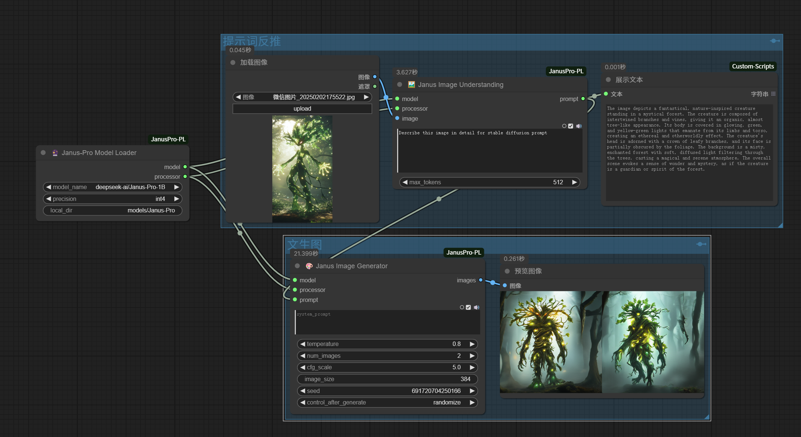

---
[中文版](./README-ZH.md)

# Janus-Pro ComfyUI Plugin

This plugin integrates the **Janus-Pro** multi-modal model into ComfyUI, enabling advanced image understanding and text-to-image generation capabilities. It supports both image analysis and creative image generation workflows.

> **Janus-Pro Model Homepage**: [https://github.com/deepseek-ai/Janus](https://github.com/deepseek-ai/Janus)

---

## Features

- **Multi-Modal Understanding**: Analyze images and generate detailed descriptions.
- **Text-to-Image Generation**: Create high-quality images from text prompts.
- **Flexible Configuration**: Supports 1B and 7B model sizes with multiple precision options (BF16, INT8, INT4).
- **ComfyUI Integration**: Seamlessly integrates with ComfyUI workflows.
- **Batch Processing**: Generate multiple images in parallel for efficient workflows.

---

## Installation

### 1. Install Dependencies

- clone to  ComfyUI `custom_nodes` directory
- Ensure you have the required dependencies installed:

```bash
git clone https://github.com/greengerong/ComfyUI-JanusPro-PL.git
pip install -r requirements.txt
```

### 2. Download Models

The plugin supports the following Janus-Pro models:

- `deepseek-ai/Janus-Pro-1B`
- `deepseek-ai/Janus-Pro-7B`

Models will be automatically downloaded on first use. Alternatively, you can manually download them and place them in the `models/Janus-Pro` directory.

#### Manually deploy file directories

```
models/Janus-Pro/
├── Janus-Pro-7B/
│   ├── config.json
│   ├── pytorch_model.bin
│   └── ...
└── Janus-Pro-1B/
    └── ...
```

---

## Usage

### Nodes Overview

1. **JanusProModelLoader**
   - Loads the Janus-Pro model with configurable precision and size.
   - Outputs: Model, Processor.

2. **JanusProImageUnderstanding**
   - Analyzes an input image and generates a detailed description.
   - Inputs: Image, Question.
   - Outputs: Text Description.

3. **JanusProImageGenerator**
   - Generates images from text prompts using the Janus-Pro model.
   - Inputs: Text Prompt, Temperature, CFG Scale, Image Size, Seed.
   - Outputs: Generated Images.

---

### Example Workflow

Below is an example workflow that combines image understanding and text-to-image generation:



---

### Parameter Guide

#### JanusProModelLoader
- **Model Name**: Choose between `Janus-Pro-1B` and `Janus-Pro-7B`.
- **Precision**: Select from `BF16`, `INT8`, or `INT4`.
- **Cache Directory**: Directory to store downloaded models (default: `models/Janus-Pro`).

#### JanusProImageUnderstanding
- **Image**: Input image to analyze.
- **Question**: Question or prompt for image analysis.
- **Max Tokens**: Maximum length of the generated description (default: 512).

#### JanusProImageGenerator
- **Prompt**: Text prompt for image generation.
- **Temperature**: Controls randomness (default: 0.8, range: 0.0-1.0).
- **CFG Scale**: Controls adherence to the prompt (default: 5.0, no upper limit).
- **Parallel Size**: Number of images to generate in parallel (default: 16).
- **Image Size**: Output image resolution (currently supports `384`).
- **Seed**: Random seed for reproducibility.

---

## Performance Tips

- **For Low VRAM GPUs**:
  - Use the `Janus-Pro-1B` model.
  - Enable `INT4` quantization.
  - Reduce `parallel_size`.

- **For Faster Generation**:
  - Use `BF16` precision.
  - Increase `parallel_size` (e.g., 16-32).

- **For High-Quality Output**:
  - Use `Janus-Pro-7B` with `BF16` precision.
  - Set `temperature` between 0.6-0.8.
  - Use `CFG Scale` between 6.0-8.0.

---

## Troubleshooting

1. **CUDA Out of Memory**:
   - Reduce `parallel_size`.
   - Use a smaller model (`Janus-Pro-1B`).
   - Enable quantization (`INT8` or `INT4`).

2. **Model Loading Failed**:
   - Check your internet connection.
   - Verify the model path in `models/janus_pro`.

3. **Low-Quality Output**:
   - Increase `CFG Scale`.
   - Use more descriptive prompts.
   - Adjust `temperature` (lower values for more deterministic results).

---

## Acknowledgments

- [Janus-Pro Model](https://github.com/deepseek-ai/Janus) by DeepSeek-AI.
- [ComfyUI](https://github.com/comfyanonymous/ComfyUI) for the amazing workflow framework.

---

## Contact

For questions or feedback, please open an issue on GitHub or contact the maintainers.

